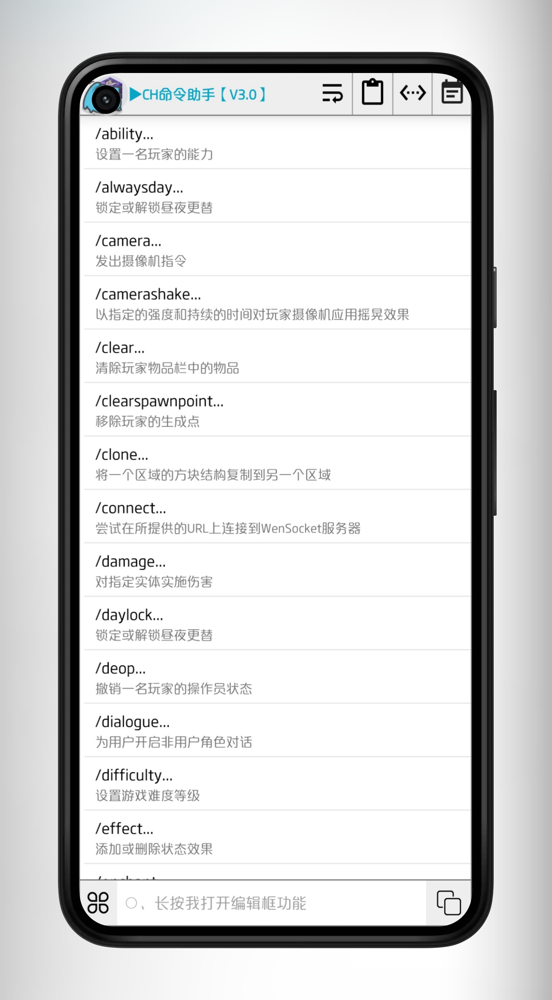
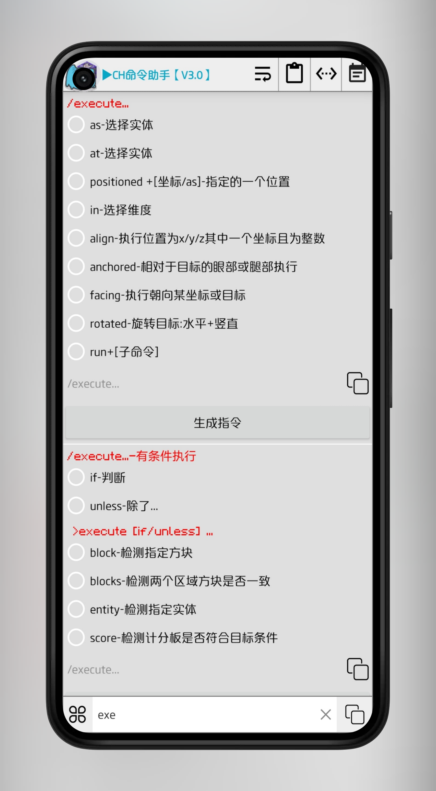

# 魔法命令
CH命令助手（魔法命令）

- 该软件非开源软件，仅网页开源，使用GitHub作为托管平台
- 由于传播，复制，分发，使用该软件带来的所有不良后果，由您自行承担
- 仅供学习，下载后请于24小时内删除。

# 下载
如需下载安装包或查看更新日志，请直接前往 [release](https://github.com/chenskiro/MystiAide/releases) 查看。

安装包可能会跳版本，但不影响使用，直接下载最新版即可

# 用户指南

前往 [ MystiAide GitHub Wiki](https://github.com/chenskiro/MystiAide/wiki) 页面。

任何人均可编辑的社区Wiki！

意见与bug反馈请前往 [issuess](https://github.com/chenskiro/MystiAide/issues)

# 部署
使用该网页源码部署网站

[](https://vercel.com/import/project?template=https://github.com/chenskiro/MystiAide/)

点击按钮使用 vercel 一键部署

或将网页源码下载到本地部署

```
git@github.com:chenskiro/MystiAide.git
```


# 功能介绍





# 赞助
项目是完全免费的
